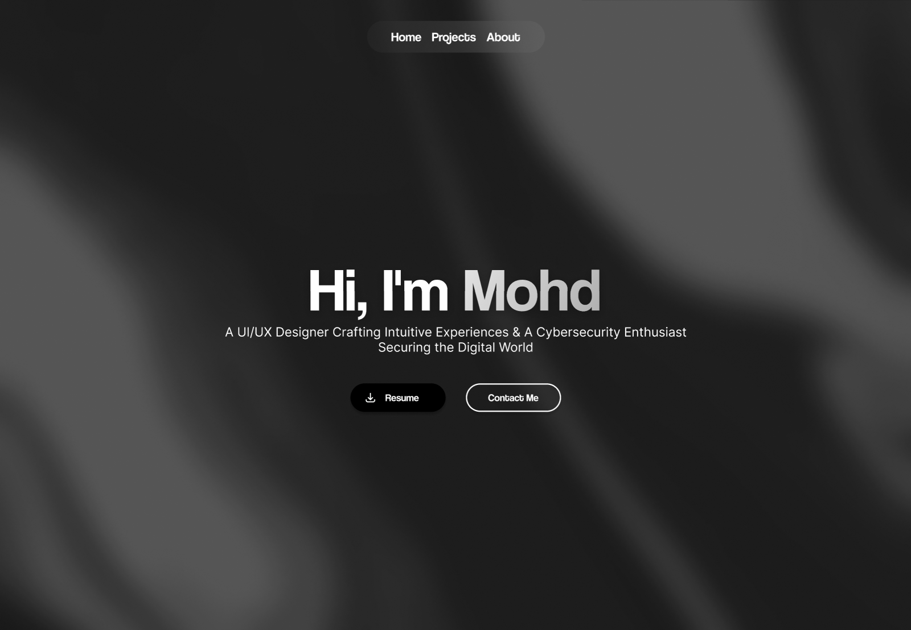
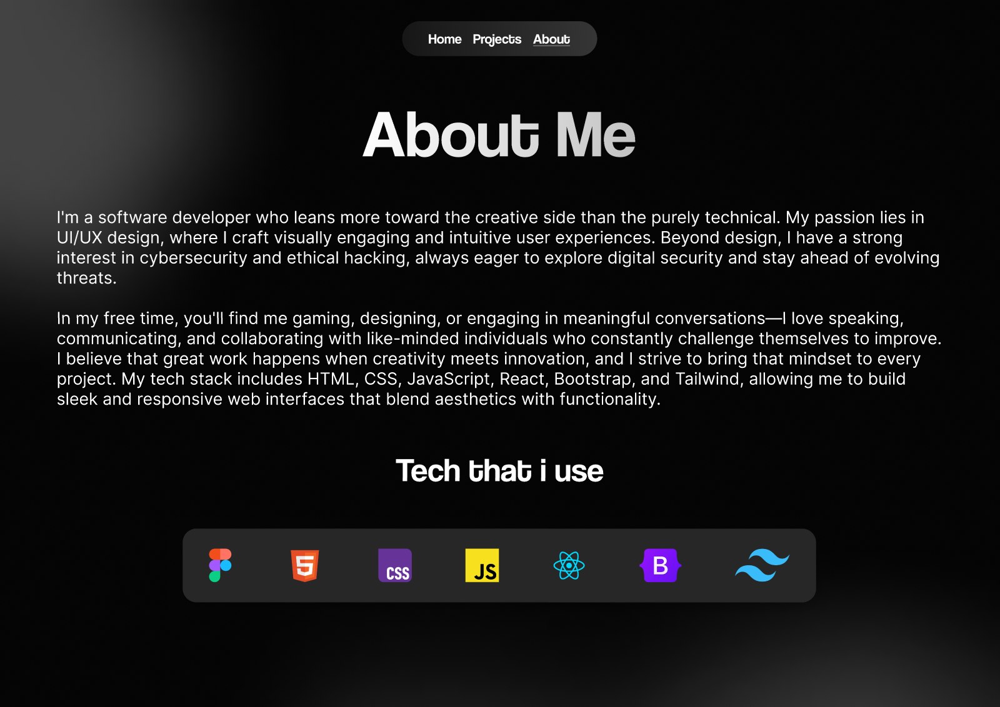

# 💼 Portfolio Website UI Design  

This repository contains a **modern and aesthetic portfolio UI design** built to highlight personal skills, projects, and professional journey. The design ensures a **clean, elegant, and user-friendly** experience, making it easy to showcase work effectively.  

## 🌟 Features  

- 🏠 **Landing Page** – A visually appealing introduction with a strong personal brand.  
- 👤 **About Me Page** – A detailed section highlighting experience, skills, and background.  

## 📸 Screenshots  

### 🏠 Landing Page  
  

### 👤 About Me Page  
  

## 🎨 Design Approach  

- **Minimalistic and elegant UI** for a professional online presence.  
- **Responsive design** to ensure a seamless experience across devices.  
- **Modern typography and layout** for a visually engaging structure.  

## 🛠️ Tools Used  

- **Figma**  
- UI/UX best practices for accessibility and usability  
